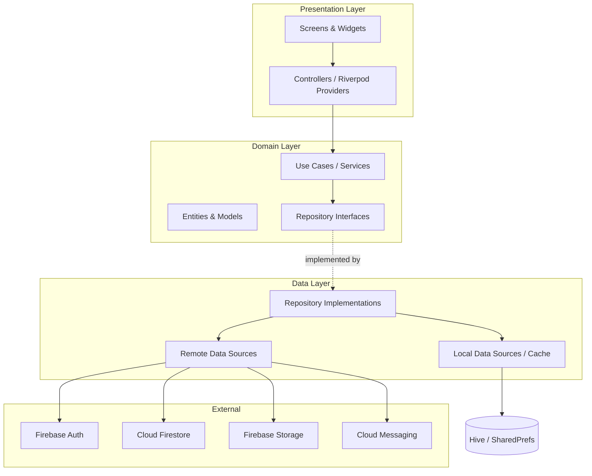
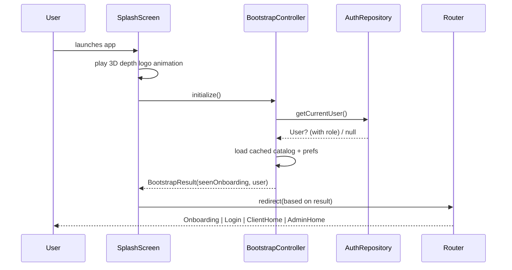
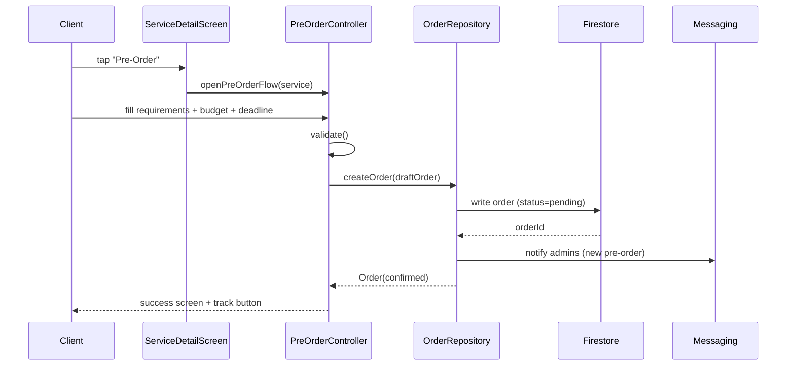
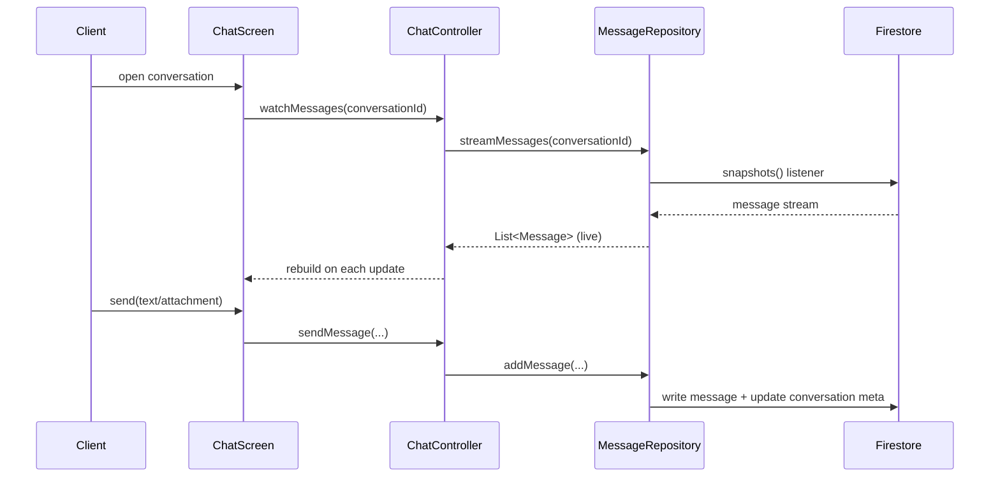
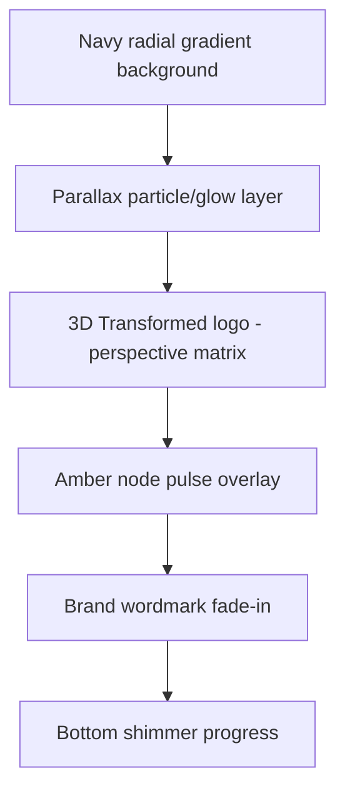
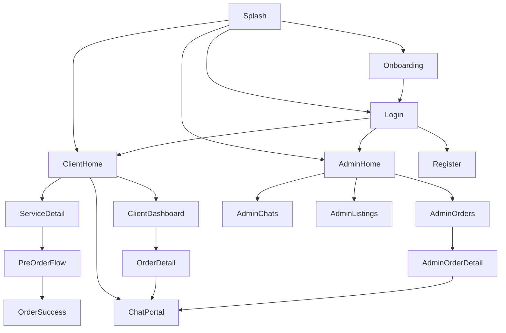

# Design Document: Keyframes App

## Overview

Keyframes is a cross-platform (iOS + Android) Flutter mobile application that acts as a **service marketplace** for the Keyframes startup. Unlike Fiverr-style platforms that connect clients to individual freelancers, this app is tailored to a small company: there is **no per-employee hiring**. Instead, clients browse a curated catalog of the company's IT and graphic-design services, place **pre-orders**, chat with the company through an in-app **client chat portal**, and track everything from a **client dashboard**. The company manages incoming pre-orders, conversations, and service listings through an **admin dashboard**.

The product is built to feel premium: a navy/amber/white design system, professional typography, a 3D-depth animated splash/preloader featuring the Keyframes logo, and tasteful motion design across every screen. The architecture favors a clean, layered separation (presentation / domain / data) with a reactive state-management approach so the UI stays fluid and the codebase stays maintainable and error-free.

This document combines **high-level design** (architecture, sequence diagrams, components, data models) with **low-level design** (widget trees, animation logic, and key function signatures in Dart) so it can directly drive implementation.

> **Backend note:** The design assumes **Firebase** as the backend-of-choice for a startup (managed auth, Firestore real-time chat/orders, Storage for assets, Cloud Messaging for notifications). The architecture isolates the backend behind repository interfaces, so it can be swapped for a custom REST backend later without touching the UI.

---

## Architecture

### High-Level Layered Architecture



### Technology & State-Management Choices

| Concern | Choice | Rationale |
|---|---|---|
| Framework | **Flutter 3.x (stable), Dart 3.x** | Cross-platform, single codebase, rich animation support. |
| State management | **Riverpod 2.x (with code-gen)** | Compile-safe, testable, no `BuildContext` coupling, great for async streams (chat/orders). |
| Navigation | **go_router** | Declarative routing, deep-link & guard support for auth/role gating. |
| Backend | **Firebase** (Auth, Firestore, Storage, Messaging) | Managed, real-time, fast to ship for a startup. |
| Local cache | **Hive** + **shared_preferences** | Offline catalog cache, onboarding/seen flags, theme prefs. |
| Models / immutability | **freezed** + **json_serializable** | Immutable models, union types, generated `copyWith`/`fromJson`. |
| Dependency injection | **Riverpod providers** | Single mechanism for DI + state. |
| Animations | **flutter built-ins**, **flutter_animate**, custom `AnimationController`s, **Transform** (3D matrix) | Splash 3D depth + micro-interactions. |
| Image/asset | **cached_network_image**, **flutter_svg** | Efficient remote images, vector logo rendering. |
| Forms/validation | **flutter_form_builder** + custom validators | Consistent validation for auth & pre-order forms. |

### Module / Folder Structure

```text
lib/
  main.dart
  app/
    app.dart                 # MaterialApp.router + theme injection
    router.dart              # go_router config + role guards
  core/
    theme/                   # colors, typography, spacing, theme data
    constants/               # asset paths, durations, breakpoints
    utils/                   # validators, formatters, result types
    widgets/                 # shared widgets (buttons, cards, loaders)
    animations/              # reusable animation builders (3D, fades)
  features/
    splash/                  # 3D preloader + bootstrap
    onboarding/
    auth/                    # login, register, role detection
    catalog/                 # home, service list, service detail
    preorder/                # pre-order flow
    chat/                    # client <-> company chat portal
    client_dashboard/        # orders, chats, status
    admin_dashboard/         # manage orders, chats, listings
  data/
    models/                  # freezed models (User, Service, Order, Message...)
    repositories/            # repo interfaces + Firebase implementations
    sources/                 # remote (Firebase) + local (Hive) sources
```

---

## Sequence Diagrams (Main Flows)

### App Bootstrap & 3D Splash



### Pre-Order Placement



### Real-Time Chat



---

## Design System

The brand uses **navy (dark blue)** and **golden amber** as primary/secondary, with **white** as the dominant surface color for a clean, professional, airy feel.

### Color Palette

| Token | Hex | Usage |
|---|---|---|
| `navy900` | `#0A1A3F` | Deepest navy — splash background, headers, gradients base |
| `navy800` | `#0F2455` | Primary brand navy — app bar, primary buttons |
| `navy600` | `#1C3A7A` | Navy mid — gradients, selected states |
| `navy400` | `#3A5BA0` | Navy accents, icons on light surfaces |
| `amber500` | `#F5A623` | Primary golden amber — CTAs, highlights, logo nodes |
| `amber400` | `#FFB940` | Amber light — hover/pressed, gradient top |
| `amber300` | `#FFD27F` | Amber tint — badges, subtle highlights |
| `white` | `#FFFFFF` | Primary surfaces, cards, backgrounds |
| `offWhite` | `#F6F8FC` | Scaffold background (soft, not pure white) |
| `slate700` | `#2B3553` | Primary text on light surfaces |
| `slate500` | `#5B647F` | Secondary text, captions |
| `slate200` | `#E3E8F2` | Dividers, borders, disabled |
| `success` | `#2DBE7E` | Order completed / positive status |
| `warning` | `#F5A623` | Pending / in-review status (amber) |
| `danger`  | `#E5484D` | Errors, cancelled order |

**Signature gradient** (used on splash, primary buttons, hero cards):

```text
LinearGradient(navy900 -> navy600)  with amber500 glow accents
PrimaryCTA gradient: amber400 -> amber500
```

### Typography Scale

Primary typeface: **Poppins** (headings, brand) + **Inter** (body, UI) via `google_fonts`.

| Style | Font | Size / Weight / Height | Usage |
|---|---|---|---|
| `displayLg` | Poppins | 34 / w700 / 1.15 | Splash tagline, hero titles |
| `headingLg` | Poppins | 26 / w600 / 1.2 | Screen titles |
| `headingMd` | Poppins | 20 / w600 / 1.25 | Section headers, dialog titles |
| `titleMd` | Poppins | 17 / w600 / 1.3 | Card titles, service names |
| `bodyLg` | Inter | 16 / w400 / 1.5 | Primary body text |
| `bodyMd` | Inter | 14 / w400 / 1.5 | Secondary text, descriptions |
| `label` | Inter | 13 / w500 / 1.3 | Buttons, chips, tabs |
| `caption` | Inter | 12 / w400 / 1.4 | Timestamps, helper text |

### Spacing, Radius & Elevation

```text
Spacing scale (4-pt base): xs=4, sm=8, md=12, lg=16, xl=24, xxl=32, xxxl=48
Radius: rSm=8, rMd=12, rLg=16, rXl=24, rPill=999
Elevation: card=soft shadow (navy900 @ 8% blur 24 y 8), modal=blur 40 y 16
Touch targets: minimum 48x48
```

### Theme Definition (low-level)

```dart
/// Centralized color tokens for the Keyframes brand.
abstract final class KColors {
  static const navy900 = Color(0xFF0A1A3F);
  static const navy800 = Color(0xFF0F2455);
  static const navy600 = Color(0xFF1C3A7A);
  static const navy400 = Color(0xFF3A5BA0);
  static const amber500 = Color(0xFFF5A623);
  static const amber400 = Color(0xFFFFB940);
  static const amber300 = Color(0xFFFFD27F);
  static const white = Color(0xFFFFFFFF);
  static const offWhite = Color(0xFFF6F8FC);
  static const slate700 = Color(0xFF2B3553);
  static const slate500 = Color(0xFF5B647F);
  static const slate200 = Color(0xFFE3E8F2);
  static const success = Color(0xFF2DBE7E);
  static const danger = Color(0xFFE5484D);
}

/// Builds the global ThemeData (light-first, navy/amber accented).
ThemeData buildKeyframesTheme();

/// Reusable spacing + radius constants.
abstract final class KSpace {
  static const xs = 4.0, sm = 8.0, md = 12.0, lg = 16.0, xl = 24.0, xxl = 32.0;
  static const rMd = 12.0, rLg = 16.0, rXl = 24.0, rPill = 999.0;
}
```

---

## 3D-Depth Animated Splash / Preloader

### Goal
A creative, premium splash showing the Keyframes logo (`assets/images/keyframes_logo.png`) with a **3D depth feel**: the logo appears to emerge from deep navy space, rotating slightly on the X/Y axes with a parallax glow, while amber "circuit nodes" pulse along the logo's connecting lines. A bottom progress shimmer indicates bootstrap progress.

### Layered Composition



### Animation Logic (low-level)

The 3D depth is achieved with a `Matrix4` perspective transform driven by an `AnimationController`. We combine: (1) a depth **scale + translateZ** entrance, (2) a subtle **rotateX/rotateY** sway, (3) an **opacity/blur** reveal, and (4) staggered **amber node pulses**.

```dart
/// Controller orchestrating the splash entrance + idle sway animations.
class SplashAnimator {
  /// Drives the one-shot entrance (depth emerge + reveal). Duration ~1600ms.
  final AnimationController entrance;
  /// Drives the looping idle sway (3D rotation). Duration ~3500ms, repeat reverse.
  final AnimationController sway;

  /// Eased depth: logo scales from 0.6 -> 1.0 with translateZ from -400 -> 0.
  Animation<double> get depth;       // Curves.easeOutCubic
  /// Logo opacity 0 -> 1 (Interval 0.2..0.7).
  Animation<double> get reveal;
  /// Wordmark slide+fade (Interval 0.6..1.0).
  Animation<double> get wordmark;
  /// Idle X/Y tilt in radians, ~[-0.08, 0.08].
  Animation<double> get tiltX;
  Animation<double> get tiltY;

  void start();   // entrance.forward(); then sway.repeat(reverse: true)
  void dispose();
}

/// Builds the perspective transform applied to the logo widget.
Matrix4 buildDepthTransform({
  required double depth,   // 0..1 entrance progress
  required double tiltX,   // radians
  required double tiltY,   // radians
}) {
  final translateZ = lerpDouble(-400.0, 0.0, depth)!;
  final scale = lerpDouble(0.6, 1.0, depth)!;
  return Matrix4.identity()
    ..setEntry(3, 2, 0.0015) // perspective (the key to 3D depth)
    ..translate(0.0, 0.0, translateZ)
    ..rotateX(tiltX)
    ..rotateY(tiltY)
    ..scale(scale);
}
```

### Widget Tree (low-level)

```dart
SplashScreen
└── Scaffold(backgroundColor: navy900)
    └── Stack
        ├── _RadialNavyBackground()                 // navy900 -> navy600 radial
        ├── _ParallaxGlowLayer(animation: sway)     // soft amber blur orbs
        ├── Center
        │   └── AnimatedBuilder(animation: merged)
        │       └── Transform(                       // buildDepthTransform(...)
        │             alignment: center,
        │             transform: matrix,
        │             child: _LogoWithPulsingNodes(  // Image.asset(logo) +
        │                       reveal: reveal))     //   CustomPaint amber nodes
        ├── Positioned(bottom)
        │   └── FadeTransition(wordmark)
        │       └── Text("KEYFRAMES", style: displayLg, color: white)
        └── Positioned(bottom)
            └── _ShimmerProgressBar(amber gradient)  // bootstrap progress
```

**Function:** `void redirectAfterSplash(BootstrapResult r)` — once `entrance` completes **and** bootstrap finishes, route via go_router to onboarding/login/client-home/admin-home.

---

## Navigation Flow



### Router (low-level)

```dart
/// Declarative routes with role-based redirect guards.
GoRouter buildRouter(Ref ref) {
  return GoRouter(
    initialLocation: '/splash',
    redirect: (context, state) => _authRoleGuard(ref, state),
    routes: [ /* splash, onboarding, auth, client shell, admin shell */ ],
  );
}

/// Returns a redirect path or null. Blocks clients from admin routes and
/// unauthenticated users from protected routes.
String? _authRoleGuard(Ref ref, GoRouterState state);
```

Two persistent **ShellRoute**s with bottom navigation:
- **Client shell:** Home · Orders · Chat · Profile
- **Admin shell:** Orders · Chats · Listings · Profile

---

## Screen-by-Screen UI Breakdown

### 1. Onboarding
- 3 swipeable pages introducing: *Browse services*, *Pre-order & track*, *Chat directly with Keyframes*.
- Parallax illustrations, page indicator (amber active dot), "Skip" + "Get Started".
- **Animation:** page-linked parallax via `PageController.offset`; staggered fade/slide of text.
- Persists `seenOnboarding=true` in Hive.

### 2. Auth (Login / Register)
- Navy gradient header with logo, white rounded form sheet rising from bottom (slide-up reveal).
- Email/password + "Continue with Google"; register collects name, email, phone.
- Inline validation, animated error shake on invalid submit, loading button morph.
- Role is resolved from the user profile document after auth (no role selector exposed to clients; admins are provisioned server-side).

### 3. Home / Service Catalog
- Greeting header + search bar (hero-animated to search screen).
- **Category chips:** IT Services · Graphic Design (filter).
- Featured carousel (auto-scroll, 3D page transform on cards).
- Grid/list of service cards: thumbnail, title, short tagline, "from" price, category badge.
- **Animation:** staggered card entrance (`flutter_animate` fadeIn+slideY), shimmer placeholders while loading.

### 4. Service Detail
- Collapsing `SliverAppBar` hero image, service title, category, description, deliverables list, sample gallery, est. timeline, starting price.
- Sticky bottom bar with gradient **"Pre-Order"** CTA.
- **Animation:** Hero transition from card thumbnail; gallery parallax; CTA pulse glow.

### 5. Pre-Order Flow (multi-step)
- Step 1: Requirements (description, reference uploads).
- Step 2: Options (package tier, deadline date picker, budget range).
- Step 3: Contact + review summary.
- Animated horizontal stepper, slide transitions between steps, confirm => `OrderSuccess` with confetti + "Track Order" / "Chat with us".

### 6. Chat Portal (client ↔ company)
- Single conversation per client with the Keyframes team (company appears as one entity).
- Message bubbles (client=amber, company=navy), timestamps, attachments, image preview, typing indicator, read receipts.
- **Animation:** bubble scale-in on send, smooth auto-scroll, attachment sheet slide-up.

### 7. Client Dashboard
- **Orders tab:** list grouped by status (Pending, In Progress, Completed, Cancelled) with status chips and progress bar.
- **Order detail:** timeline of status updates, linked chat, service info, requirements recap.
- **Profile:** edit profile, theme/notification prefs, logout.

### 8. Admin Dashboard
- **Overview:** KPI cards (new pre-orders, active chats, completed this month) with count-up animation.
- **Orders management:** filter/search, update status (drag or dropdown), assign internal note.
- **Chats:** list of client conversations with unread badges; open to reply.
- **Listings:** CRUD service listings (title, category, description, gallery, base price, active toggle).

---

## Components and Interfaces

### Shared Widgets

```dart
/// Gradient primary button with morphing loading state and press scale.
class KPrimaryButton extends StatelessWidget {
  KPrimaryButton({required this.label, required this.onPressed, this.loading});
}

/// Glassy elevated card used for services & dashboard tiles.
class KCard extends StatelessWidget { /* radius rLg, soft navy shadow */ }

/// Status chip mapping OrderStatus -> color/label.
class KStatusChip extends StatelessWidget { KStatusChip(this.status); }

/// Reusable 3D-tilt wrapper for hero cards (perspective on drag/scroll).
class KTilt3D extends StatefulWidget { KTilt3D({required this.child, this.maxTilt}); }

/// Shimmer skeleton loader for catalog/list placeholders.
class KShimmer extends StatelessWidget {}
```

### Repository Interfaces (domain)

```dart
abstract interface class AuthRepository {
  Stream<AppUser?> authState();
  Future<AppUser> signIn({required String email, required String password});
  Future<AppUser> register(RegisterInput input);
  Future<AppUser> signInWithGoogle();
  Future<void> signOut();
  Future<AppUser?> currentUser();
}

abstract interface class ServiceRepository {
  Stream<List<ServiceListing>> watchServices({ServiceCategory? category});
  Future<ServiceListing> getById(String id);
  // Admin:
  Future<String> upsert(ServiceListing listing);
  Future<void> setActive(String id, bool active);
  Future<void> delete(String id);
}

abstract interface class OrderRepository {
  Future<Order> createOrder(OrderDraft draft);
  Stream<List<Order>> watchClientOrders(String clientId);
  Stream<List<Order>> watchAllOrders({OrderStatus? filter}); // admin
  Future<void> updateStatus(String orderId, OrderStatus status, {String? note});
  Stream<Order> watchOrder(String orderId);
}

abstract interface class ChatRepository {
  Stream<Conversation> ensureConversation(String clientId);
  Stream<List<Message>> streamMessages(String conversationId);
  Future<void> sendMessage(SendMessageInput input);
  Stream<List<Conversation>> watchAllConversations(); // admin
  Future<void> markRead(String conversationId, String readerId);
}
```

### Controllers (Riverpod, presentation)

```dart
/// Async catalog state with category filtering.
@riverpod
class CatalogController extends _$CatalogController {
  @override
  Stream<List<ServiceListing>> build({ServiceCategory? category});
}

/// Pre-order multi-step form state + submission.
@riverpod
class PreOrderController extends _$PreOrderController {
  void setRequirements(String text);
  void setPackage(PackageTier tier);
  void setDeadline(DateTime date);
  Future<Order> submit();      // validates then calls OrderRepository
}

/// Live chat controller for a conversation.
@riverpod
class ChatController extends _$ChatController {
  @override
  Stream<List<Message>> build(String conversationId);
  Future<void> send(String text, {List<Attachment> attachments});
}
```

---

## Data Models

### Entity Relationship

```mermaid
erDiagram
    AppUser ||--o{ Order : places
    AppUser ||--|| Conversation : has
    ServiceListing ||--o{ Order : "ordered as"
    Conversation ||--o{ Message : contains
    Order ||--o{ OrderStatusEvent : tracks

    AppUser { string id PK; string name; string email; string phone; string role; string photoUrl }
    ServiceListing { string id PK; string title; string category; string description; double basePrice; bool active }
    Order { string id PK; string clientId FK; string serviceId FK; string status; string packageTier; DateTime deadline }
    Conversation { string id PK; string clientId FK; int unreadClient; int unreadAdmin; DateTime updatedAt }
    Message { string id PK; string conversationId FK; string senderId; string type; string text; DateTime sentAt }
```

### Model Definitions (low-level, freezed)

```dart
enum UserRole { client, admin }
enum ServiceCategory { itServices, graphicDesign }
enum OrderStatus { pending, inReview, inProgress, completed, cancelled }
enum PackageTier { basic, standard, premium }
enum MessageType { text, image, file, system }

@freezed
class AppUser with _$AppUser {
  const factory AppUser({
    required String id,
    required String name,
    required String email,
    String? phone,
    String? photoUrl,
    @Default(UserRole.client) UserRole role,
    required DateTime createdAt,
  }) = _AppUser;
  factory AppUser.fromJson(Map<String, dynamic> json) => _$AppUserFromJson(json);
}

@freezed
class ServiceListing with _$ServiceListing {
  const factory ServiceListing({
    required String id,
    required String title,
    required String tagline,
    required String description,
    required ServiceCategory category,
    required double basePrice,
    @Default(<String>[]) List<String> deliverables,
    @Default(<String>[]) List<String> gallery,
    String? thumbnailUrl,
    @Default(true) bool active,
    @Default(0) int estimatedDays,
  }) = _ServiceListing;
  factory ServiceListing.fromJson(Map<String, dynamic> json) =>
      _$ServiceListingFromJson(json);
}

@freezed
class Order with _$Order {
  const factory Order({
    required String id,
    required String clientId,
    required String serviceId,
    required String serviceTitle,
    required PackageTier packageTier,
    required String requirements,
    @Default(<String>[]) List<String> attachments,
    double? budget,
    DateTime? deadline,
    @Default(OrderStatus.pending) OrderStatus status,
    @Default(<OrderStatusEvent>[]) List<OrderStatusEvent> timeline,
    required DateTime createdAt,
  }) = _Order;
  factory Order.fromJson(Map<String, dynamic> json) => _$OrderFromJson(json);
}

@freezed
class OrderStatusEvent with _$OrderStatusEvent {
  const factory OrderStatusEvent({
    required OrderStatus status,
    String? note,
    required DateTime at,
  }) = _OrderStatusEvent;
  factory OrderStatusEvent.fromJson(Map<String, dynamic> json) =>
      _$OrderStatusEventFromJson(json);
}

@freezed
class Conversation with _$Conversation {
  const factory Conversation({
    required String id,
    required String clientId,
    required String clientName,
    String? lastMessage,
    @Default(0) int unreadClient,
    @Default(0) int unreadAdmin,
    required DateTime updatedAt,
  }) = _Conversation;
  factory Conversation.fromJson(Map<String, dynamic> json) =>
      _$ConversationFromJson(json);
}

@freezed
class Message with _$Message {
  const factory Message({
    required String id,
    required String conversationId,
    required String senderId,
    required MessageType type,
    String? text,
    String? mediaUrl,
    required DateTime sentAt,
    @Default(false) bool read,
  }) = _Message;
  factory Message.fromJson(Map<String, dynamic> json) => _$MessageFromJson(json);
}
```

**Validation Rules**
- `AppUser.email` must match a valid email regex; `name` non-empty (2–60 chars); `phone` optional but if present must be 7–15 digits.
- `ServiceListing.basePrice >= 0`; `title` 3–80 chars; `category` required.
- `Order.requirements` non-empty (min 10 chars); `deadline` (if set) must be in the future; `packageTier` required.
- `Message`: a `text` message must have non-empty `text`; an `image`/`file` message must have `mediaUrl`.

---

## Algorithmic Pseudocode (Key Logic)

### Bootstrap & Routing Decision

```dart
/// Determines the initial route after the splash completes.
Future<BootstrapResult> bootstrap();
```

**Preconditions:** Firebase initialized; Hive boxes opened.
**Postconditions:** Returns a `BootstrapResult` with `seenOnboarding`, `user` (nullable, includes role). No UI navigation performed inside (pure decision data).

```pascal
ALGORITHM bootstrap()
OUTPUT: BootstrapResult
BEGIN
  seen  ← localPrefs.getBool("seenOnboarding") OR false
  user  ← authRepository.currentUser()        // may be null
  preloadCatalogCache()                        // best-effort, non-blocking
  RETURN BootstrapResult(seenOnboarding ← seen, user ← user)
END

ALGORITHM resolveInitialRoute(result)
INPUT: result of type BootstrapResult
OUTPUT: route path
BEGIN
  IF result.user = null THEN
    IF NOT result.seenOnboarding THEN RETURN "/onboarding"
    ELSE RETURN "/login"
  END IF
  IF result.user.role = admin THEN RETURN "/admin/orders"
  ELSE RETURN "/home"
END
```

### Pre-Order Submission

```pascal
ALGORITHM submitPreOrder(draft)
INPUT: draft of type OrderDraft
OUTPUT: Order
PRECONDITION: user is authenticated AND draft.serviceId references active listing
POSTCONDITION: order persisted with status=pending AND admins notified
BEGIN
  ASSERT draft.requirements.length >= 10
  ASSERT draft.deadline = null OR draft.deadline > now()
  ASSERT draft.packageTier ≠ null

  order ← Order(
            id ← newId(), clientId ← currentUser.id,
            status ← pending, createdAt ← now(),
            timeline ← [ StatusEvent(pending, "Pre-order received", now()) ])
  orderRepository.createOrder(order)
  messaging.notifyAdmins(NEW_PREORDER, order.id)
  RETURN order
END
```

**Loop Invariant (status timeline):** every appended `OrderStatusEvent` has `at >= ` the previous event's `at`, and the order's current `status` always equals `timeline.last.status`.

### Admin Status Update

```pascal
ALGORITHM updateOrderStatus(orderId, newStatus, note)
PRECONDITION: caller.role = admin AND transition(current, newStatus) is allowed
POSTCONDITION: order.status = newStatus AND timeline gains one event AND client notified
BEGIN
  order ← orderRepository.watchOrder(orderId).current
  ASSERT isValidTransition(order.status, newStatus)
  event ← StatusEvent(newStatus, note, now())
  orderRepository.updateStatus(orderId, newStatus, note)   // appends event
  messaging.notifyClient(order.clientId, ORDER_UPDATED, newStatus)
END
```

Allowed transitions: `pending → inReview → inProgress → completed`; any non-completed → `cancelled`.

---

## Example Usage

```dart
// Watching the catalog in the Home screen.
final servicesAsync = ref.watch(catalogControllerProvider(category: selected));
servicesAsync.when(
  data: (services) => ServiceGrid(services: services),
  loading: () => const KShimmer(),
  error: (e, _) => KErrorView(onRetry: () => ref.invalidate(catalogControllerProvider)),
);

// Submitting a pre-order.
final controller = ref.read(preOrderControllerProvider.notifier);
controller
  ..setRequirements(requirementsText)
  ..setPackage(PackageTier.standard)
  ..setDeadline(selectedDate);
final order = await controller.submit();
context.go('/order-success', extra: order);

// Live chat stream.
final messages = ref.watch(chatControllerProvider(conversationId));
```

---

## Correctness Properties

1. **Role isolation:** ∀ navigation attempts, a user with `role = client` can never resolve to any `/admin/**` route, and an unauthenticated user can never resolve to a protected route. (`_authRoleGuard` always redirects.)
2. **Order status monotonicity:** ∀ orders, `order.status == order.timeline.last.status`, and timeline timestamps are non-decreasing.
3. **Valid transitions only:** ∀ status updates, `isValidTransition(old, new)` holds; illegal transitions are rejected without mutating state.
4. **Pre-order validity:** ∀ created orders, `requirements.length ≥ 10` ∧ (`deadline == null` ∨ `deadline > createdAt`) ∧ `packageTier ≠ null`.
5. **Message well-formedness:** ∀ messages, (`type == text ⟹ text` is non-empty) ∧ (`type ∈ {image,file} ⟹ mediaUrl ≠ null`).
6. **Unread accuracy:** ∀ conversations, after `markRead(conversationId, readerId)`, the reader's unread counter equals 0.
7. **Splash determinism:** the app always leaves the splash exactly once, only after both the entrance animation completes and `bootstrap()` resolves (no infinite preloader, no double navigation).
8. **No employee-hiring surface:** no route, screen, or model exposes per-employee selection/hiring (catalog is service-centric only).

---

## Error Handling

| Scenario | Condition | Response | Recovery |
|---|---|---|---|
| No network | Catalog/chat fetch fails | Show cached data (Hive) + offline banner | Auto-retry on connectivity regained |
| Auth failure | Wrong credentials / cancelled Google sign-in | Inline error + button shake animation | User retries; password reset link offered |
| Order write fails | Firestore write error | Non-blocking snackbar, keep draft in memory | Retry submit; draft not lost |
| Permission denied | Client hits admin endpoint | Guard redirect + toast | Route to client home |
| Image upload fails | Storage error | Mark attachment failed with retry icon | Tap to re-upload |
| Empty states | No orders / no chats / empty catalog | Friendly illustrated empty state | CTA to browse services |

A shared `Result<T>` / `AsyncValue` pattern wraps repository calls so the UI uniformly renders loading / data / error.

---

## Animation Strategy

| Area | Technique | Notes |
|---|---|---|
| Splash 3D depth | `Matrix4` perspective + `AnimationController` | Entrance emerge + idle sway + amber node pulse |
| Screen transitions | go_router `CustomTransitionPage` | Shared-axis / fade-through |
| Hero images | `Hero` widgets | Card → detail thumbnail continuity |
| List/grid entrance | `flutter_animate` staggered fadeIn+slideY | Cap stagger to avoid jank on long lists |
| Buttons | press `scale` + loading morph | `AnimatedSwitcher` for label↔spinner |
| Chat bubbles | scale+fade in on insert | `AnimatedList` for smooth insertion |
| Dashboard KPIs | count-up `TweenAnimationBuilder` | Numbers animate from 0 |
| 3D card tilt | `KTilt3D` perspective on drag/scroll | Featured carousel cards |

**Performance guardrails:** prefer `const` widgets, `RepaintBoundary` around animated regions, keep heavy effects at 60fps, disable non-essential motion when `MediaQuery.disableAnimations` is true (accessibility).

---

## Testing Strategy

### Unit Testing
- Validators (email, phone, requirements length, deadline future).
- `isValidTransition` state machine for order status.
- `resolveInitialRoute` decision logic for all role/onboarding combinations.
- Model `fromJson`/`toJson` round-trips.

### Property-Based Testing
- **Library:** Dart `glados` (or `fast_check`-style generators).
- Properties to verify: order status monotonicity, valid-transitions-only, message well-formedness, pre-order validity, route role-isolation. Generate random sequences of status updates / random messages / random users+routes and assert the correctness properties hold.

### Widget & Integration Testing
- Widget tests: splash renders + auto-navigates (using fake bootstrap), catalog loading/error/data states, pre-order form validation, chat send appends bubble.
- Integration (`integration_test`): full pre-order happy path and client↔admin chat round-trip against Firebase emulator suite.

---

## Performance Considerations
- Lazy-load catalog with pagination; cache thumbnails via `cached_network_image`.
- Firestore listeners scoped per screen and disposed via Riverpod autoDispose.
- Offline-first catalog from Hive for instant cold-start after first run.
- Image compression on upload (attachments) to limit Storage cost/bandwidth.

## Security Considerations
- **Firestore security rules** enforce: clients read/write only their own orders/conversations; only `admin` role can mutate listings or any order status; listings publicly readable when `active`.
- Auth tokens managed by Firebase Auth; role claim stored in the user doc and (ideally) mirrored to a custom claim for rule enforcement.
- Input sanitization on all free-text fields; file-type/size validation on uploads.
- No secrets in the client; admin provisioning done server-side (no client-exposed admin signup).

## Dependencies

```text
flutter_riverpod / riverpod_annotation + riverpod_generator
go_router
firebase_core, firebase_auth, cloud_firestore, firebase_storage, firebase_messaging
google_sign_in
freezed_annotation + freezed + json_serializable + build_runner
hive, hive_flutter, shared_preferences
google_fonts
flutter_svg, cached_network_image
flutter_animate
flutter_form_builder + form_builder_validators
image_picker
intl
dev: glados (property tests), mocktail, integration_test
```

---

## Assets

```text
assets/images/keyframes_logo.png        # stylized "K" navy+amber circuit logo (supplied by company)
assets/images/keyframes_logo.svg        # vector variant (preferred for crisp scaling)
assets/images/onboarding_*.png          # onboarding illustrations
assets/animations/                       # optional Lottie/particle assets
```

> All logo placeholders across the app (splash, auth header, app bars, empty states) reference `assets/images/keyframes_logo.png` (or the `.svg` variant) until the company supplies the final asset.
